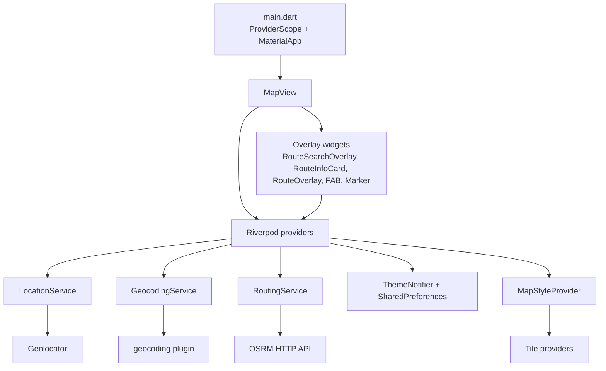
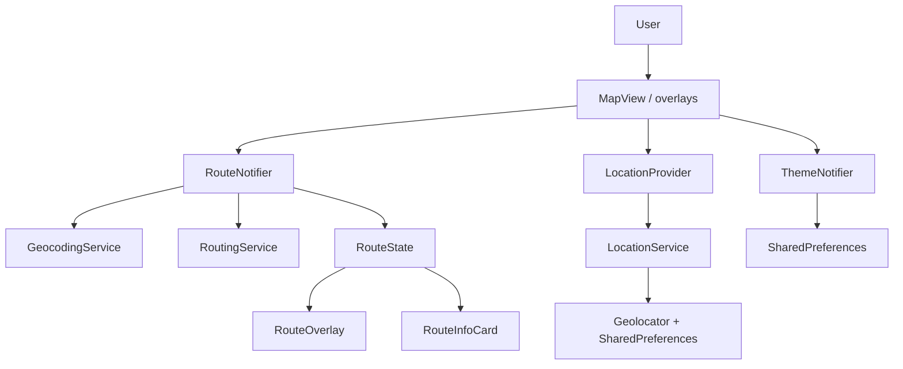
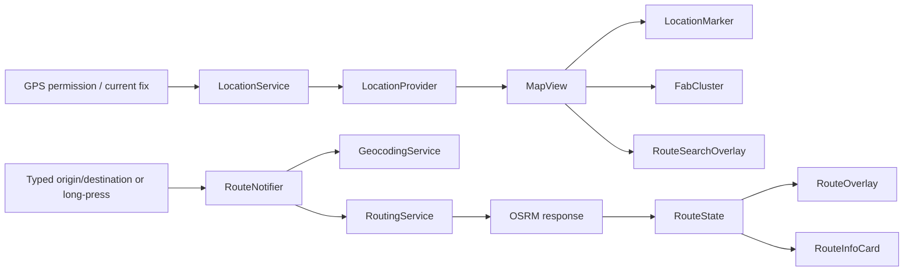
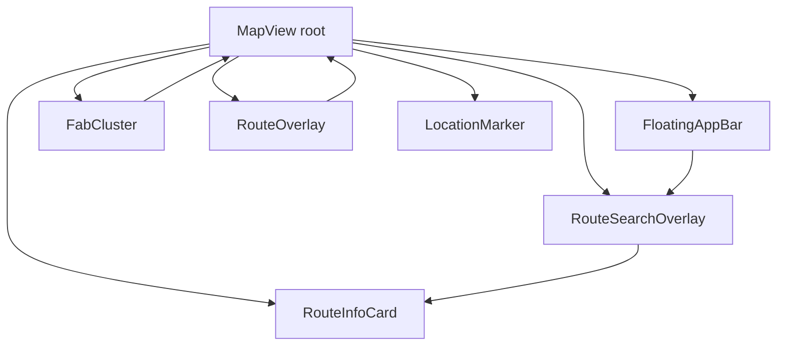

# SureStep Technical Assessment

## 1. Project Overview

SureStep is a single-screen Flutter map application focused on live location display, ad hoc route planning, and map-style switching. The current app flow is centered on one map canvas with transient overlays for search and route summary, not a multi-route navigation shell.

| Dimension | Assessment |
|---|---|
| Purpose | Show current GPS position, plan routes from typed addresses or map long-presses, and render route geometry on a map |
| Core objectives | Map interaction, route fetching, location awareness, theme persistence, visual map style switching |
| MVP scope | Functional demo-grade route planner with live location, route overlay, and minimal settings |
| Implementation maturity | Early MVP / prototype; usable core flow, weak production hardening |

Evidence: bootstrap is in main.dart and the repository README is currently empty at README.md.

## 2. Architecture Analysis

The app uses a provider-driven presentation architecture: UI widgets consume Riverpod state, providers orchestrate side effects, and services wrap external IO. There is no formal repository/domain/data split, no feature module boundary, and no navigation layer beyond overlays.

| Layer | Responsibility | Evidence |
|---|---|---|
| Bootstrap | App startup, `ProviderScope`, root theme selection | main.dart |
| Presentation | Map canvas, overlays, controls, markers | map_view.dart |
| State orchestration | Theme, route, location, overlay visibility, map style | route_provider.dart |
| External IO | GPS, geocoding, routing, persistence | location_service.dart |
| Design system | Typography and color system | theme.dart |

Scalability is limited by the single global route state, absence of feature boundaries, and service calls embedded in UI-facing notifiers.

## 3. System Design

Runtime is straightforward: app boots, loads theme, starts the location stream, paints a map, then reacts to user interaction by resolving geocoding and route fetches against public services.

External integrations:
- GPS and permission management via Geolocator.
- Reverse and forward geocoding via the geocoding plugin.
- Route geometry via OSRM public API.
- Map tiles via OpenStreetMap, HOT, and optional Thunderforest URLs.
- Simple persistence via SharedPreferences.

Storage is limited to:
- Last known coordinates in SharedPreferences.
- Theme mode in SharedPreferences.

## 4. Data Flow Analysis

The app has two main flows: location acquisition and route planning.

Data lifecycle:
- User opens app.
- Theme state is restored asynchronously.
- Location provider requests permission, emits cached or live position, then streams updates.
- Route input is converted to coordinates using geocoding.
- Route coordinates are submitted to OSRM.
- Successful route state updates trigger overlay rendering and camera fit.

Async patterns:
- `StreamProvider` for location.
- `StateNotifierProvider` for route and theme.
- `Future`-based geocoding and routing calls.
- UI reacts to state transitions rather than imperative callback chains.

Weaknesses:
- External failures are mostly collapsed to `null` or a generic error string.
- No retry policy, backoff, telemetry, or request cancellation.
- Location stream fallback logic is incomplete, so error recovery is fragile.

## 5. State Management

The app uses Riverpod 2.x with a mix of `StateNotifierProvider`, `StreamProvider`, `StateProvider`, and plain providers.

| Provider | Owner | State type | Notes |
|---|---|---|---|
| `themeProvider` | `ThemeNotifier` | `ThemeMode` | Persists to SharedPreferences |
| `locationProvider` | `LocationService` | `LocationState` stream | Permission and GPS-backed |
| `routeProvider` | `RouteNotifier` | `RouteState` | Owns route lookup orchestration |
| `mapStyleProvider` | `MapStyleNotifier` | `MapStyle` | No persistence |
| `routeOverlayVisibleProvider` | `StateProvider<bool>` | bool | UI-only transient flag |
| `mapControllerProvider` | plain provider | `MapController` | App-lifetime controller instance |

State lifecycle:
- Theme persists across launches.
- Location streams continuously while permission is granted.
- Route state is session-scoped and cleared manually.
- Overlay visibility is ephemeral and UI-driven.

Rebuild strategy:
- Most rebuilds are localized to small widgets.
- `MapView` rebuilds on location and overlay changes.
- Tile layer rebuild is isolated to a consumer.
- One current bug: `FloatingAppBar` watches `themeProvider.notifier` instead of the state, so it can miss theme updates.

Memory and leak risk:
- Controllers are disposed correctly in stateful widgets.
- `mapControllerProvider` is app-lifetime only; acceptable for this size.
- No obvious leak in the current widget/controller lifecycle.

## 6. Routing & Navigation

Navigation is not route-based. The app is a single screen with overlay layers.

Assessment:
- Route architecture: no Navigator stack, no named routes, no router package.
- Screen hierarchy: one root screen with transient overlays.
- Transition handling: local animated widgets only.
- Deep linking readiness: absent.
- Route safety: no guardrails for invalid input beyond null/error returns.

This is sufficient for an MVP but not for a multi-screen product.

## 7. Feature Breakdown

| Feature | Purpose | Logic flow | Dependencies | Risks / limitations |
|---|---|---|---|---|
| Live location | Show current position and GPS status | Permission check -> position stream -> cached fallback | Geolocator, SharedPreferences | Error fallback is weak; no permission UX recovery |
| Route search overlay | Type origin/destination and get route | Text input -> geocoding -> route fetch -> auto-dismiss on success | RouteNotifier, geocoding, OSRM | No history, no validation helpers, no cancellation |
| Map long-press routing | Quick route from tapped map points | First long press sets origin, second sets destination | Reverse geocoding, RouteNotifier | State can become ambiguous after route reset |
| Route summary card | Display distance and ETA | Success state -> animated card | RouteState | No alternate route, no turn-by-turn guidance |
| Route overlay | Draw polyline and pins on map | Success state -> polyline + markers | flutter_map, RouteState | Rendering depends on successful route fetch only |
| Theme toggle | Switch light/dark theme and persist | Toggle -> SharedPreferences -> MaterialApp themeMode | ThemeNotifier, SharedPreferences | UI icon can desync from actual theme |
| Map style switcher | Switch tile style | Popup menu -> mapStyleProvider | flutter_map tile layer | Thunderforest variants fall back to standard OSM tiles without config |
| GPS status chip / FAB | Show location freshness and recenter map | Read current location state, move map controller | MapController, LocationProvider | No disabled state when location is unavailable |

## 8. Screen Responsibility Matrix

| Screen / widget | Purpose | UI responsibility | Business logic ownership | State dependencies | Services consumed | Performance concerns |
|---|---|---|---|---|---|---|
| MapView | Main application shell | Hosts map, overlays, and layers | Light orchestration only | Location, route, overlay, map style | None directly except geocoding in long-press handler | Map rebuilds are costly; keep child rebuilds isolated |
| RouteSearchOverlay | Route entry form | Search fields, loading, error state | Submits route requests | Route state, location state, overlay visibility | RouteNotifier | Animation and state listen logic must stay bounded |
| RouteInfoCard | Route result summary | Distance, ETA, clear action | None | Route state | RouteNotifier | Minor |
| FloatingAppBar | Top utility bar | Search, style switch, theme toggle, status chip | UI only | Theme, location, map style, overlay visibility | ThemeNotifier, MapStyleNotifier | Theme subscription bug can cause stale icon |
| FabCluster | Center-on-location button | Single floating action button | None | Location state | MapController | Minimal |
| RouteOverlay | Map polyline and pins | Visual route rendering | None | Route state | flutter_map | Polyline layer depends on route success |
| LocationMarker | Pulsing current position marker | Animated marker | None | Location state | None | Light animation cost |
| SearchPanel | Legacy/unused route entry panel | Duplicate search UI | Duplicate flow | Route state | RouteNotifier | Dead code, maintenance burden |

`SearchPanel` is not referenced by the active app flow, which makes it dead/legacy code rather than a live screen.

## 9. Services & Utilities

| Component | Role | Notes |
|---|---|---|
| `LocationService` | Requests permission, emits current and streamed location, caches last known coordinates | Uses geolocator + SharedPreferences |
| `GeocodingService` | Forward and reverse geocoding | Returns `null` on failure, no logging |
| `RoutingService` | Fetches OSRM route and decodes polyline | Hard-coded public endpoint, 15s timeout |
| `ThemeNotifier` | Loads and persists theme mode | Async read on startup, toggles light/dark |
| `MapStyleProvider` | Tracks active map style and tile URL selection | No persistence, Thunderforest key plumbing is unused |
| `theme/util.dart` | Typography factory | Single source of text theme |

Service boundaries are reasonable, but the orchestration layer still contains too much product logic for long-term scale.

## 10. Dependency & Tech Stack Audit

| Item | Version / status | Assessment |
|---|---|---|
| Flutter SDK | Not pinned in repo | Build reproducibility is weaker than it should be |
| Dart SDK | `^3.11.3` in pubspec | Modern target, but not fully environment-pinned |
| `flutter_map` | `^7.0.2` | Core map rendering dependency |
| `latlong2` | `^0.9.1` | Coordinate value objects |
| `geolocator` | `^13.0.2` | Location permissions and streams |
| `geocoding` | `^3.0.0` | Address/coordinate resolution |
| `flutter_riverpod` | `^2.6.1` | State management backbone |
| `http` | `^1.2.2` | Routing API client |
| `shared_preferences` | `^2.3.3` | Lightweight persistence |
| `google_fonts` | `^8.1.0` | Typography |
| Lint baseline | `flutter_lints` via analysis_options.yaml | Minimal but acceptable |

Backend and SDK integrations:
- OSRM public routing API.
- Public tile servers.
- Geolocator and platform permission handlers.
- SharedPreferences for local persistence only.

Unsafe or production-blocking dependency concerns:
- Android release config is still debug-signed.
- Android app ID and namespace are placeholder values.

## 11. Code Quality Assessment

| Category | Assessment |
|---|---|
| Naming consistency | Mostly clear and descriptive |
| Folder hygiene | Good broad split, but not feature-isolated |
| Reusability | Moderate; small widgets are reusable |
| SOLID adherence | Service abstractions help, but notifier + UI orchestration is mixed |
| Clean code compliance | Mostly good for a prototype |
| Widget composition | Reasonably decomposed |
| Duplication | `SearchPanel` duplicates `RouteSearchOverlay` |
| Maintainability score | 6/10 |

Positive:
- Clear separation between services, state, and widgets.
- Value objects for route/location state are simple and readable.
- Controllers are disposed properly.

Negative:
- Some logic is duplicated across route-entry widgets.
- The active screen owns too much orchestration.
- Theme update subscription is implemented incorrectly in one widget.

## 12. Performance Audit

| Area | Assessment |
|---|---|
| Widget rebuild risk | Moderate, mostly localized |
| Rendering inefficiency | Map canvas is heavy by nature, but child isolation is decent |
| Memory concerns | Low-to-moderate; no obvious leak |
| Async bottlenecks | Geolocation, geocoding, and OSRM are sequential and blocking on user flow |
| Layout efficiency | Fine overall; overlays are simple |
| Large widget tree | Single screen, moderate complexity |
| Startup/load performance | Slight delay expected from theme load and GPS permission handshake |

Key notes:
- Location stream writes to SharedPreferences on each fix, which is acceptable at this scale but not ideal for very high-frequency updates.
- Route success triggers camera fit; this is a good UX choice, but should remain guarded against repeated fits if state churn grows.
- The map-style consumer isolates tile rebuilds well.

## 13. Error Handling & Logging

Exception handling strategy:
- Most service methods catch everything and return `null`.
- Route notifier turns `null` into a user-facing error message.
- No logging, telemetry, or diagnostic tracing exists.

Recovery flow:
- Location permission denied: cached position or null marker.
- Geocoding fail: route error state.
- Routing fail: route error state.
- Stream error fallback is not robust enough.

Important defect:
- `LocationService.positionStream` uses `handleError` as if it were a recovery emission, but that does not reliably produce a replacement `LocationState`. See location_service.dart.

Debugging readiness:
- Weak, because failures are swallowed and no logs are emitted.

## 14. Security Review

| Issue | Evidence | Severity | Impact |
|---|---|---|---|
| Debug-signed release build | build.gradle.kts | Critical | Release builds are not production-secure |
| Placeholder app ID / namespace | build.gradle.kts | High | App identity is not production-ready |
| Overbroad iOS location entitlement | Info.plist | High | Requests `Always` usage text without a background-tracking flow |
| No secret management | repo-wide | Low | No hardcoded keys found, but no environment system exists |
| SharedPreferences for location cache | location_service.dart | Low | Fine for demo coordinates, not for sensitive data |

## 15. Testing Assessment

No test files were found under `test/`.

Coverage gaps:
- Unit tests for `RouteNotifier`, `ThemeNotifier`, and `LocationService`.
- Widget tests for `MapView`, `RouteSearchOverlay`, `RouteInfoCard`, and `FloatingAppBar`.
- Integration tests for permission handling, GPS denial, route failures, and offline behavior.

QA risk areas:
- Permission denied / denied forever.
- No network / slow network.
- Geocoding mismatch or zero-result lookups.
- Route API failures.
- Theme persistence on cold start.

## 16. MVP Evaluation

| Aspect | Status |
|---|---|
| Live map experience | Present |
| Route planning | Present |
| Current location | Present |
| Map style switching | Present, but incomplete without key plumbing |
| Theme persistence | Present |
| Production readiness | Not ready |
| Feature completeness for a demo | Good |
| Feature completeness for a production navigation app | Low |

